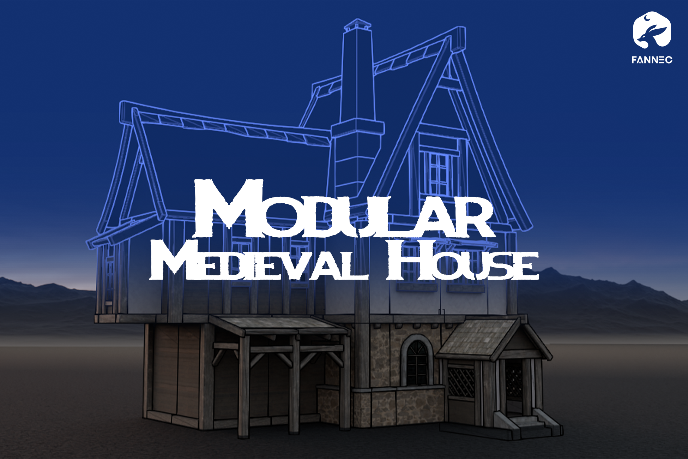

Modular Medieval House Creator
=============

**Modular Medieval House** Creator  a professional toolkit for building historical environments, cottages, and ancient town centers in Blender using a modular snapping system.
Quickly assemble authentic medieval structures using pre-made timber frame and stone components, or expand the database with your own custom assets.

Features
--------

* **One-click house construction**: Build homes fast using pre-made walls, roofs, floors and structural elements
* **Smart snapping system**: Components align perfectly for seamless construction
* **Expandable library**: Easily add your own custom parts to the growing collection
* **Visual part browser**: Find what you need quickly with categorized thumbnails
* **Precision placement tools**: Move, rotate and mirror parts with grid-snapped controls
* **Complete workflow**: From foundation to roof with all necessary architectural elements included

Support
-------

If you have any questions get in touch via :doc:`contact`.

Contents
--------

.. toctree::
   :maxdepth: 2

   installation
   tools
   changelog
   contact
